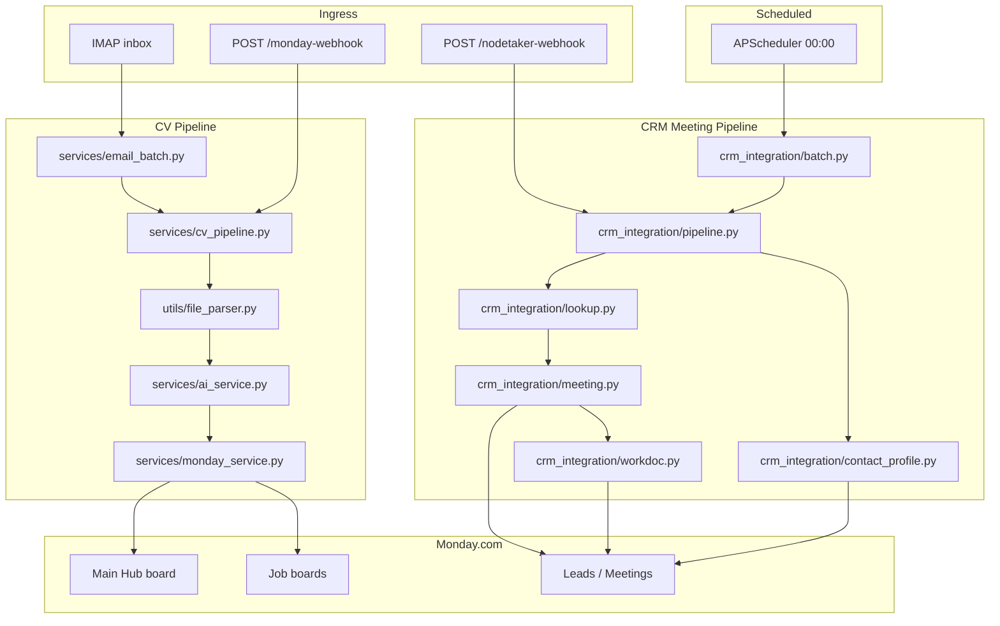

# Recruitment AI Backend — System Specification

> Last updated: 2026-06-30  
> Scope: `recruitment-ai-backend` (Python monolith)

## Purpose

This backend automates two recruitment-agency workflows for a Monday.com–centric CRM:

1. **CV pipeline** — Ingest résumés (email or Monday upload), extract structured candidate profiles with Claude, and upsert them onto Monday boards.
2. **CRM meeting pipeline** — Ingest meeting transcripts/summaries (NodeTaker webhook or Monday Notetaker API batch), match participants to clients/leads, create meeting items, attach Workdocs, and update contact AI profiles.

Both pipelines share Monday GraphQL helpers and run from a single FastAPI application in production.

**Note on “RAG”:** The current system is **extractive structured AI** (tool-calling + Pydantic validation), not retrieval-augmented generation. There is no vector database, embedding index, or semantic search layer yet. RAG would be a natural next layer for recruiter Q&A over CVs and meeting history (see `decisions.md`).

---

## Tech Stack

| Layer | Technology | Role |
|-------|------------|------|
| Runtime | Python 3.11+ (3.14 in local dev) | Application language |
| Web framework | FastAPI 0.115+ | HTTP API, webhooks, background tasks |
| ASGI server | Uvicorn | Production process (`render.yaml`) |
| Scheduling | APScheduler 3.10+ (AsyncIOScheduler) | In-process cron jobs (ISR timezone) |
| LLM | Anthropic Claude (`claude-sonnet-4-6` default) | CV extraction, job-fit scoring, client profile updates |
| LLM SDK | `anthropic` async client | Structured tool use + retries |
| Config | Pydantic Settings v2 + `python-dotenv` | Typed env loading (`core/config.py`, `crm_integration/config.py`) |
| HTTP client | `httpx`, `requests` | Monday API, file downloads |
| Document parsing | `pypdf`, `python-docx` | PDF/DOCX → plain text (hyperlink-aware) |
| Email | `imap-tools` | IMAP attachment fetch |
| Validation | Pydantic v2, `email-validator` | `CandidateSchema`, webhook payloads |
| Testing | `pytest` (stdlib `unittest` style in places) | Unit + integration tests |
| Deployment | Render.com | Web service via `render.yaml` |

### External Services

| Service | Integration |
|---------|-------------|
| **Monday.com** | GraphQL API — boards, items, files, Workdocs, Notetaker meetings |
| **Anthropic** | Messages API with custom tool schema |
| **IMAP mailbox** | Daily CV attachment polling |
| **NodeTaker / Monday Notetaker** | Meeting summaries via webhook + batch fetch |

---

## High-Level Architecture



---

## Entry Points

| Entry | Command / Route | Use case |
|-------|-----------------|----------|
| Production server | `uvicorn app:app --host 0.0.0.0 --port 8000` | Webhooks, health, scheduled jobs |
| CLI email batch | `python main.py` | One-off: process today's IMAP CVs |
| Health | `GET /health` | Liveness probe |
| CV webhook | `POST /monday-webhook` | Monday form upload / file column change |
| CRM webhook | `POST /nodetaker-webhook` | Real-time meeting ingestion |

### Scheduled Jobs (in-process, Asia/Jerusalem)

| Time | Job | Module |
|------|-----|--------|
| 00:00 | Notetaker sync | `app.py` → `crm_integration/batch.py` → `run_daily_notetaker_batch()` |
| 07:00 | Morning briefings | `crm_integration/batch.py` → `process_morning_briefs()` |
| 08:00 | Email CV batch | `services/email_batch.py` → `process_email_cv_batch()` |

---

## CV Pipeline — Data Flow

```
CV bytes (PDF/DOCX)
  → file_parser.extract_text_from_file()
  → [optional] fetch_board_job_requirements(board_id)  # job boards only
  → ai_service.analyze_cv_with_claude(cv_text, job_requirements?)
  → Pydantic validate CandidateSchema (+ sanitize + 1 retry on validation error)
  → monday_service.upsert_candidate_item(board_id, candidate, file?)
  → [if not Main Hub] sync to MONDAY_BOARD_ID
```

### Key design choices

- **Upsert by identity:** Match existing items by normalized email or phone before creating duplicates.
- **Schema-driven Monday mapping:** Each `CandidateSchema` field carries `json_schema_extra.monday_id` for column binding.
- **Israeli recruiting heuristics:** Long system prompt in `ai_service.py` (city inference, Haredi sector, professional-only experience years, programming language cap of 5).
- **Job-fit scoring:** When triggered from a job board, Claude scores fit (1–10) against דרישות משרה with a hard-requirement gate (max score 3 if any חובה fails).
- **Low-confidence guard:** CVs with `extraction_confidence=low` and no name/email/phone are skipped.
- **Email dedup:** Message-ID + SHA-256 hash state file (7-day retention) in `temp_received_cvs/`.

---

## CRM Meeting Pipeline — Data Flow

```
NodeTakerWebhookPayload (title, date, participants, summary, action_items)
  → lookup.find_contact_by_emails()  # clients first, then leads
  → meeting.create_meeting_item()    # classify type, dedupe
  → workdoc.create_meeting_workdoc() # or fallback to summary column
  → ai_service.extract_client_meeting_profile()
  → contact_profile.update_contact_ai_profile()
```

### Contact matching rules

- Normalize and dedupe participant emails.
- Filter internal `@beyondtcode.com` from external participant storage.
- Unmatched meetings may be skipped (pipeline returns `status=skipped`) depending on configuration path.

---

## Configuration Model

Settings are split intentionally:

| Module | Env prefix / vars | Concern |
|--------|-------------------|---------|
| `core/config.py` | `ANTHROPIC_*`, `MONDAY_BOARD_ID` | Shared AI + Main Hub |
| `crm_integration/config.py` | `MONDAY_CRM_*`, Mirly reminder board IDs | CRM boards/columns |
| Inline / email | `EMAIL_HOST`, `EMAIL_USER`, `EMAIL_PASSWORD` | IMAP ingestion |
| Monday shared | `MONDAY_API_KEY` | All GraphQL calls |

Missing email credentials do not crash the server; the 08:00 job logs a warning and skips.

---

## API Contract Summary

### `POST /monday-webhook`

- Handles Monday URL verification (`challenge` echo).
- Accepts standard webhook `event` payloads (`create_pulse`, `create_item`, `change_column_value` on `file_*` columns) and custom app `payload.inputFields`.
- Returns `{"status": "success"}` immediately; CV processing runs in `BackgroundTasks`.

### `POST /nodetaker-webhook`

- Body: `NodeTakerWebhookPayload` (Pydantic).
- Returns `NodeTakerWebhookResult` with match type, meeting item ID, warnings.

---

## Project Layout

```
recruitment-ai-backend/
├── app.py                      # FastAPI app, schedulers, /monday-webhook
├── main.py                     # CLI email CV runner
├── core/config.py              # Global settings
├── models/candidate.py         # CandidateSchema (Monday column contract)
├── services/
│   ├── ai_service.py           # Claude extraction + sanitizers
│   ├── cv_pipeline.py          # Shared CV orchestration
│   ├── email_batch.py          # IMAP batch + dedup
│   ├── email_service.py        # IMAP low-level fetch
│   └── monday_service.py       # Candidate upsert, GraphQL, job-fit columns
├── utils/file_parser.py        # PDF/DOCX + URL download
├── crm_integration/            # Meeting → CRM subsystem
│   ├── routes.py               # /nodetaker-webhook
│   ├── pipeline.py             # CRM orchestrator
│   ├── lookup.py, meeting.py, workdoc.py, contact_profile.py
│   ├── monday_client.py, monday_fetcher.py, batch.py, reminders.py
│   └── config.py, schemas.py
├── test_*.py                   # Test suite
├── requirements.txt
└── render.yaml                 # Render deployment
```

---

## Observability & Operations

- **Logging:** Standard library `logging`, INFO level, structured-ish text format.
- **Temp storage:** `temp_received_cvs/` for email attachments and dedup state; cleaned after processing.
- **No persistent DB:** All durable state lives in Monday.com (plus local dedup JSON for email).
- **Dev endpoint:** `GET /test-fetch-sarah` — manual Notetaker fetch + CRM pipeline test (should not be exposed in production without auth).

---

## Security Posture (current)

| Area | Status |
|------|--------|
| API keys | Env vars only (`.env` locally, Render dashboard in prod) |
| Webhook auth | Monday challenge only on CV webhook; NodeTaker webhook has no shared secret |
| Batch endpoint | `X-Batch-Secret` header required |
| PII | CVs and meeting transcripts flow through logs minimally; temp files on disk |

---

## Test Coverage Map

| File | Focus |
|------|-------|
| `test_pipeline.py` | End-to-end CV pipeline |
| `test_ai_sanitize.py` | Post-extraction sanitizers |
| `test_file_parser.py` | PDF/DOCX parsing, hyperlinks |
| `test_monday_upsert.py` | Column mapping, job-fit, upsert logic |
| `test_monday_cv_file.py` | Monday file download |
| `test_webhook.py` | Monday webhook parsing |
| `test_email_batch.py` | Attachment gates, dedup |
| `test_crm_nodetaker_webhook.py` | CRM pipeline, briefings, Notetaker |
| `test_connection.py` | Monday API smoke test |

Run: `pytest`
