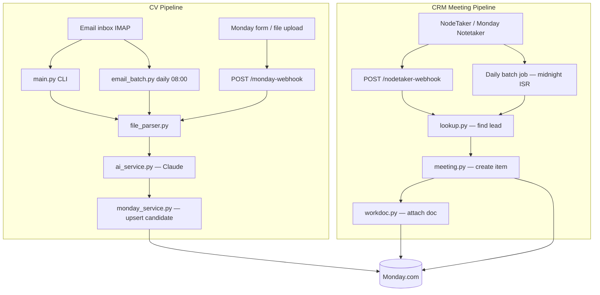

# Recruitment AI Backend

A Python backend that connects **Monday.com**, **Claude (Anthropic)**, and optional **email** / **meeting-note** sources for a recruitment agency workflow. It does two related but separate jobs:

1. **CV pipeline** — When a candidate uploads a CV (via email or a Monday form), the server extracts structured profile data with AI and writes it back to Monday boards.
2. **CRM meeting pipeline** — When a meeting is recorded (via NodeTaker / Monday Notetaker), the server creates meeting notes on a CRM board, links them to leads, and attaches a Workdoc with the full summary.

Both systems share Monday API helpers and run from the same FastAPI app in production.

---

## Table of contents

- [Big picture](#big-picture)
- [How to run](#how-to-run)
- [Environment variables](#environment-variables)
- [API endpoints](#api-endpoints)
- [System 1: CV pipeline](#system-1-cv-pipeline)
- [System 2: CRM meeting pipeline](#system-2-crm-meeting-pipeline)
- [Project structure (file by file)](#project-structure-file-by-file)
- [Tests](#tests)
- [Deployment](#deployment)

---

## Big picture




| Entry point              | When to use it                                                 |
| ------------------------ | -------------------------------------------------------------- |
| `app.py` (via `uvicorn`) | Production server: webhooks, health check, scheduled CRM + email CV jobs |
| `main.py`                | One-off CLI: poll today's email inbox and process CV attachments           |


---

## How to run

### Prerequisites

- Python 3.11+ recommended
- A `.env` file in the project root (see [Environment variables](#environment-variables))

### Install dependencies

```bash
pip install -r requirements.txt
```

### Start the web server (production-style)

```bash
uvicorn app:app --host 0.0.0.0 --port 8000
```

This starts FastAPI with:

- CV webhook at `POST /monday-webhook`
- CRM webhook at `POST /nodetaker-webhook`
- A **morning briefing cron** at 07:00 Asia/Jerusalem (in-process; requires the server to be awake)
- A **daily email CV batch** at 08:00 Asia/Jerusalem (in-process; scans IMAP and upserts to Main Hub)
- A **Notetaker batch webhook** at `POST /run-notetaker-batch` — call at 00:00 from an external cron to wake the server; batch runs at 00:05

### Run email CV ingestion (CLI)

```bash
python main.py
```

Polls the configured IMAP inbox for **all messages from today** (read and unread), applies strict CV attachment filtering, and upserts candidates to the Main Hub.

### Email ingestion behavior

The scheduled job (`app.py`, 08:00) and CLI (`main.py`, today only) share `services/email_batch.py`:

1. **Lookback window** — scheduler scans all emails from the past ~24 hours (`date_gte=yesterday`); CLI scans today only.
2. **No UNSEEN dependency** — read and unread messages are both included; `\Seen` is not used for filtering or dedup.
3. **Attachment filtering** — only `.pdf` / `.docx` with valid magic bytes, minimum 2 KB size, and non-denylisted filenames.
4. **CV content validation** — minimum text length and keyword heuristics before Claude; schema validation failures count as skipped, not errors.
5. **Deduplication** — `Message-ID` + SHA-256 state file (7-day retention) avoids re-processing the same attachment; Main Hub upsert by email/phone updates existing profiles instead of creating duplicates.

### Health check

```bash
curl http://localhost:8000/health
```

---

## Environment variables

Create a `.env` file. Variables are grouped by which system needs them.

### Shared / CV pipeline


| Variable                | Required | Purpose                                                  |
| ----------------------- | -------- | -------------------------------------------------------- |
| `ANTHROPIC_API_KEY`     | Yes (CV) | Claude API key for CV extraction                         |
| `ANTHROPIC_MODEL`       | No       | Model name (default: `claude-sonnet-4-6`)                |
| `MONDAY_API_KEY`        | Yes      | Monday.com API token                                     |
| `MONDAY_BOARD_ID`       | Yes (CV) | **Main Hub** board ID — central candidate board          |
| `MONDAY_FILE_COLUMN_ID` | No       | Column ID for CV file uploads (default: `file_mm3gnkmj`) |
| `MONDAY_GROUP_ID`       | No       | Group for new items (default: `topics`)                  |


### Email ingestion (scheduled job + CLI)


| Variable         | Required    | Purpose              |
| ---------------- | ----------- | -------------------- |
| `EMAIL_HOST`     | Yes (email) | IMAP server hostname |
| `EMAIL_USER`     | Yes (email) | IMAP username        |
| `EMAIL_PASSWORD` | Yes (email) | IMAP password        |

Required for the **08:00 daily email CV batch** in `app.py` and for manual runs via `main.py`. If unset, the scheduled job logs a warning and skips without crashing the server.


### CRM meeting pipeline (`crm_integration/`)


| Variable                                             | Required  | Purpose                                    |
| ---------------------------------------------------- | --------- | ------------------------------------------ |
| `MONDAY_CRM_LEADS_BOARD_ID`                          | Yes (CRM) | Board ID for leads (all CRM contacts)      |
| `MONDAY_CRM_LEADS_EMAIL_COLUMN_ID`                   | Yes (CRM) | Email column on leads board                |
| `MONDAY_CRM_MEETING_NOTES_BOARD_ID`                  | Yes (CRM) | Board where customer meeting items are created |
| `MONDAY_CRM_MEETING_NOTES_GROUP_ID`                  | No        | Group for new meetings (default: `topics`) |
| `MONDAY_CRM_COMPANY_MEETINGS_BOARD_ID`               | No        | Board for internal-only meetings (default: `5099503871`) |
| `MONDAY_CRM_COMPANY_MEETINGS_GROUP_ID`               | No        | Group for company meetings (default: `topics`) |
| `BEYONDCODE_COMPANY_CLIENT_ITEM_ID`                   | No        | BeyondCode lead item for company meeting relations (default: `3018755375`) |
| `BEYONDCODE_COMPANY_CLIENT_NAME`                     | No        | Fallback lead name lookup on Leads board (default: `ביונד קוד בע"מ`) |
| `MONDAY_CRM_MEETING_DATE_COLUMN_ID`                  | Yes (CRM) | Date column on meeting board               |
| `MONDAY_CRM_MEETING_LEAD_RELATION_COLUMN_ID`         | Yes (CRM) | Board relation → lead                      |
| `MONDAY_CRM_MEETING_DOC_COLUMN_ID`                   | Yes (CRM) | Column that holds the Workdoc (company meetings) |
| `MONDAY_CRM_MEETING_SUMMARY_COLUMN_ID`               | Yes (CRM) | Short summary text column                  |
| `MONDAY_CRM_MEETING_EXTERNAL_PARTICIPANTS_COLUMN_ID` | No        | External participant emails                |
| `MONDAY_CRM_MEETING_ACTION_ITEMS_COLUMN_ID`          | No        | Action items text column                   |
| `MONDAY_CRM_MEETING_TYPE_COLUMN_ID`                  | No        | Meeting type dropdown                      |


---

## API endpoints


| Method | Path                 | Purpose                                                           |
| ------ | -------------------- | ----------------------------------------------------------------- |
| `GET`  | `/health`            | Liveness check — returns `{"status": "ok"}`                       |
| `POST` | `/monday-webhook`    | Monday.com webhook for CV processing                              |
| `POST` | `/nodetaker-webhook` | NodeTaker webhook for meeting → CRM                               |
| `POST` | `/run-notetaker-batch` | Wake server at 00:00; schedules Notetaker sync for 00:05 ISR (`X-Batch-Secret` header) |
| `GET`  | `/test-fetch-sarah`  | **Dev only** — manually fetch a test meeting and run CRM pipeline |


### `POST /monday-webhook`

Triggered by Monday when:

- A new item is created (`create_pulse` / `create_item`) — e.g. form submission, or
- A **file column** changes (`change_column_value` where `columnId` starts with `file_`)

Flow:

1. Respond immediately with `{"status": "success"}` (work runs in the background).
2. Download the CV file from the Monday item.
3. Extract text → send to Claude → upsert candidate fields on the source board.
4. If the source board is not the Main Hub, also sync to the Main Hub board.

Monday URL verification: if the body contains `"challenge"`, the server echoes it back.

### `POST /nodetaker-webhook`

Expects JSON matching `NodeTakerWebhookPayload`:

```json
{
  "meeting_title": "Intro call with Acme",
  "meeting_date": "2026-06-17",
  "participant_emails": ["client@example.com", "dev@beyondtcode.com"],
  "meeting_summary": "Discussed hiring needs...",
  "action_items": "- Send JD\n- Schedule follow-up"
}
```

Flow: match participant emails to a lead → prepend meeting into rolling Workdoc on lead row → Claude extracts a Hebrew company profile + latest meeting date → update the matched lead item on Monday (column IDs in `crm_integration/contact_profile.py`). Internal-only (Beyond Code) meetings still create rows on the company meetings board unchanged.

## System 1: CV pipeline

**Goal:** Turn a raw CV (PDF/DOCX) into structured candidate data on Monday.

### Step-by-step

```
CV arrives (email or Monday upload)
        ↓
utils/file_parser.py — extract plain text (handles PDF hyperlinks, DOCX headers)
        ↓
services/ai_service.py — Claude extracts fields into CandidateSchema
        ↓
services/monday_service.py — find existing item by email/phone or create new one
        ↓
Monday board updated (name, skills, city, summary, file, ecosystem columns, etc.)
```

### Key behaviors

- **Upsert, not always create:** If a candidate with the same email or phone already exists on the board, the item is updated instead of duplicated.
- **Main Hub sync:** Webhook-triggered CVs are written to the triggering board *and* the Main Hub (`MONDAY_BOARD_ID`), unless the trigger already came from the Hub.
- **AI rules are strict:** `ai_service.py` contains a long system prompt tuned for Israeli tech recruiting (city inference, Haredi sector, professional-only experience years, etc.). Post-processing sanitizers clear fields that must never come from CVs (`test_score`, `interview_summaries`).
- **Email path:** `email_batch.py` scans IMAP for PDF/DOCX CVs (read + unread), validates content, deduplicates via Message-ID + file hash and Main Hub email/phone upsert. Runs daily at **08:00** in `app.py` or manually via `main.py` (today only).

### Data model

`models/candidate.py` defines `CandidateSchema` — every field maps to a Monday column via `json_schema_extra.monday_id`. This is the contract between Claude's tool output and `monday_service.py`.

---

## System 2: CRM meeting pipeline

**Goal:** When a meeting is transcribed/summarized, automatically log it in Monday CRM and link it to the right contact.

### Step-by-step

```
Meeting data arrives (webhook or Notetaker API batch)
        ↓
crm_integration/lookup.py — search Leads board by participant email
        ↓
crm_integration/meeting.py — create item on Meeting Notes board
        ↓
crm_integration/workdoc.py — create Monday Workdoc with title, participants, summary, action items
        ↓
services/ai_service.py — extract_client_meeting_profile (JSON: profile + latest_date)
        ↓
crm_integration/contact_profile.py — update matched lead item on Monday
```

### Two ways meetings enter the system

1. **Real-time webhook** — `POST /nodetaker-webhook` (routed via `crm_integration/routes.py`).
2. **Daily batch** — An external scheduler calls `POST /run-notetaker-batch` at 00:00 to wake the server; the batch runs at **00:05 Asia/Jerusalem**. Requires `BATCH_SECRET` in the environment and the `X-Batch-Secret` request header.

### Contact matching

- Participant emails are normalized and deduplicated.
- All contacts are matched on the **Leads** board by participant email.
- Internal `@beyondtcode.com` addresses are filtered out when storing external participants.
- If no match is found, the meeting item is still created — just without a board relation.

### Meeting type classification

`meeting.py` auto-labels meetings (e.g. "פגישת היכרות", "סגירה", "מצגת") based on keywords in the title and summary.

---

## Project structure (file by file)

```
recruitment-ai-backend/
├── app.py                  # FastAPI app — webhooks, scheduler, health
├── main.py                 # CLI entry — email CV ingestion
├── requirements.txt        # Python dependencies
├── render.yaml             # Render.com deployment config
│
├── core/
│   └── config.py           # Global settings (Anthropic key, model, Main Hub board ID)
│
├── models/
│   ├── __init__.py         # Re-exports CandidateSchema
│   └── candidate.py        # Pydantic schema for extracted candidate fields
│
├── services/
│   ├── ai_service.py       # Claude CV extraction + validation + sanitizers
│   ├── cv_pipeline.py      # Shared CV flow used by email, webhook, and tests
│   ├── email_batch.py      # Daily email CV batch orchestration, validation, dedup
│   ├── email_service.py    # IMAP: fetch PDF/DOCX attachments (all messages in window)
│   └── monday_service.py   # Monday GraphQL: upsert candidates, column mapping, file upload
│
├── utils/
│   └── file_parser.py      # PDF/DOCX text extraction, URL download for Monday files
│
├── crm_integration/        # NodeTaker → Monday CRM (meetings, not CVs)
│   ├── __init__.py
│   ├── config.py           # CRM-specific Monday board/column IDs (CrmSettings)
│   ├── schemas.py          # NodeTakerWebhookPayload, NodeTakerWebhookResult
│   ├── routes.py           # FastAPI router — POST /nodetaker-webhook
│   ├── pipeline.py         # Orchestrates lookup → meeting item → workdoc
│   ├── lookup.py           # Find lead by participant email
│   ├── meeting.py          # Create meeting board item, classify meeting type
│   ├── workdoc.py          # Create and populate Monday Workdoc blocks
│   ├── monday_client.py    # GraphQL queries/mutations for CRM (thin wrapper)
│   ├── monday_fetcher.py   # Pull meetings from Monday Notetaker API
│   └── batch.py            # Process recent Notetaker meetings (daily job)
│
└── test_*.py               # Unit/integration tests (see Tests section)
```

### Root files


| File                   | Role                                                                                                                                                                   |
| ---------------------- | ---------------------------------------------------------------------------------------------------------------------------------------------------------------------- |
| `**app.py**`           | The production server. Registers CRM routes, handles `/monday-webhook`, starts APScheduler for morning briefings (07:00) and email CV batch (08:00), exposes `/health` and a dev test endpoint. |
| `**main.py**`          | Standalone script: `process_email_cv_batch(lookback_days=0)` for same-day manual email CV ingestion.                                                                                                 |
| `**requirements.txt**` | Dependencies: FastAPI, Anthropic SDK, httpx, pypdf, python-docx, imap-tools, APScheduler, Pydantic, etc.                                                               |
| `**render.yaml**`      | Deploys as a Render web service running `uvicorn app:app`.                                                                                                             |


### `core/`


| File            | Role                                                                                                                       |
| --------------- | -------------------------------------------------------------------------------------------------------------------------- |
| `**config.py**` | Loads `ANTHROPIC_API_KEY`, `ANTHROPIC_MODEL`, `MONDAY_BOARD_ID` from `.env` via Pydantic Settings. Used by the CV/AI path. |


### `models/`


| File               | Role                                                                                                                                                                                                                                              |
| ------------------ | ------------------------------------------------------------------------------------------------------------------------------------------------------------------------------------------------------------------------------------------------- |
| `**candidate.py**` | Defines `CandidateSchema` (name, email, phone, city, job categories, programming languages, etc.) and `ProgrammingLanguageExperience`. Each field documents its Monday column ID. This is the single source of truth for what Claude must return. |


### `services/`


| File                    | Role                                                                                                                                                                                                                                                                      |
| ----------------------- | ------------------------------------------------------------------------------------------------------------------------------------------------------------------------------------------------------------------------------------------------------------------------- |
| `**ai_service.py**`     | Sends CV text to Claude with a structured tool call. Validates against `CandidateSchema`, retries once on validation errors, then sanitizes output (e.g. strips city notes when city is empty, caps programming languages at 5).                                          |
| `**cv_pipeline.py**`    | **The shared CV orchestrator.** `process_cv_bytes()` / `process_cv_file()` — parse → AI → Monday upsert (returns `UpsertResult`). `process_monday_webhook()` — download file from Monday item first. |
| `**email_batch.py**`    | `process_email_cv_batch()` — IMAP fetch, text/CV validation, Message-ID + SHA-256 dedup, Main Hub upsert stats. Used by scheduler and `main.py`.                                                       |
| `**email_service.py**`  | Connects to IMAP, downloads validated PDF/DOCX from all messages in the lookback window to `temp_received_cvs/`. Does not mutate `\Seen`.                                                               |
| `**monday_service.py**` | Large module: all Monday.com API interaction for **candidates**. Maps `CandidateSchema` fields to column JSON, resolves dropdown labels, uploads CV files, searches for existing items by email/phone, upserts items, and provides `post_graphql()` used by CRM code too. |


### `utils/`


| File                 | Role                                                                                                                                                                |
| -------------------- | ------------------------------------------------------------------------------------------------------------------------------------------------------------------- |
| `**file_parser.py`** | Converts PDF/DOCX bytes to plain text. Preserves hidden hyperlinks (important for LinkedIn URLs). `download_cv_from_url()` fetches files from Monday's signed URLs. |


### `crm_integration/`


| File                    | Role                                                                                                                                                                          |
| ----------------------- | ----------------------------------------------------------------------------------------------------------------------------------------------------------------------------- |
| `**config.py**`         | `CrmSettings` — all CRM board and column IDs from environment. Separate from `core/config.py` because CRM uses different boards.                                              |
| `**schemas.py**`        | Request/response models for the NodeTaker webhook.                                                                                                                            |
| `**routes.py**`         | FastAPI `APIRouter` mounted in `app.py`; exposes `POST /nodetaker-webhook`.                                                                                                   |
| `**pipeline.py**`       | `process_nodetaker_webhook()` — the CRM equivalent of `cv_pipeline.py`: lookup contact → create meeting → create workdoc → return result with warnings.                       |
| `**lookup.py**`         | `find_contact_by_emails()` — queries Monday Leads board for items matching participant emails.                                                               |
| `**meeting.py**`        | Builds column values, classifies meeting type, checks for duplicate meetings, creates the meeting item via `create_item` mutation.                                            |
| `**workdoc.py**`        | Creates a Monday Workdoc on the meeting item and inserts formatted blocks (titles, bullets, paragraphs). Falls back to updating the summary column if Workdoc creation fails. |
| `**monday_client.py**`  | CRM-specific GraphQL query/mutation strings and `execute_graphql()` — delegates to `services.monday_service.post_graphql`.                                                    |
| `**monday_fetcher.py**` | Reads from Monday's `notetaker.meetings` API. Used by the daily batch and the `/test-fetch-sarah` dev endpoint.                                                               |
| `**batch.py**`          | `process_recent_notetaker_meetings()` — fetches last N hours of meetings, skips existing ones, runs the pipeline for each new meeting.                                        |


### Temporary / generated (not source code)


| Path                             | Role                                                                     |
| -------------------------------- | ------------------------------------------------------------------------ |
| `temp_received_cvs/`             | Downloaded CV files and `.processed_attachments.json` dedup state; cleaned up after processing. |
| `.env`                           | Local secrets — **never commit**.                                        |
| `__pycache__/`, `.pytest_cache/` | Python/test caches — ignore.                                             |


---

## Tests

Run all tests:

```bash
pytest
```


| Test file                       | What it covers                                                                                          |
| ------------------------------- | ------------------------------------------------------------------------------------------------------- |
| `test_crm_nodetaker_webhook.py` | CRM webhook endpoint, contact lookup, meeting classification, Workdoc building, Notetaker fetch helpers |
| `test_email_batch.py`           | Email attachment gate, CV text heuristics, hash dedup, batch summary stats                          |
| `test_pipeline.py`              | CV pipeline integration                                                                                 |
| `test_ai_sanitize.py`           | AI output sanitizers (recruiter notes, test_score, etc.)                                                |
| `test_file_parser.py`           | PDF/DOCX text extraction                                                                                |
| `test_monday_cv_file.py`        | Downloading CV files from Monday items                                                                  |
| `test_monday_upsert.py`         | Candidate upsert logic and column mapping                                                               |
| `test_webhook.py`               | Monday CV webhook parsing                                                                               |
| `test_connection.py`            | Quick Monday API connectivity check                                                                     |


---

## Deployment

The project is configured for [Render](https://render.com) via `render.yaml`:

- **Build:** `pip install -r requirements.txt`
- **Start:** `uvicorn app:app --host 0.0.0.0 --port $PORT`
- Set `ANTHROPIC_API_KEY` and `MONDAY_API_KEY` (and all other required env vars) in the Render dashboard.

Point Monday webhooks at:

- CV processing → `https://<your-host>/monday-webhook`
- NodeTaker meetings → `https://<your-host>/nodetaker-webhook`

---

## Quick mental model


| Question                            | Answer                                                                     |
| ----------------------------------- | -------------------------------------------------------------------------- |
| Where does the server run?          | `app.py` via uvicorn (Render in prod)                                      |
| How do CVs get in?                  | Email (daily 08:00 batch or `main.py` CLI) or Monday upload (`/monday-webhook`) |
| Who reads the CV?                   | Claude in `ai_service.py`                                                  |
| Where does candidate data go?       | Monday boards via `monday_service.py`                                      |
| How do meetings get in?             | NodeTaker webhook or daily Notetaker batch                                 |
| Where does meeting data go?         | CRM Meeting Notes board + Workdoc                                          |
| What's shared between both systems? | `MONDAY_API_KEY`, `monday_service.post_graphql()`, general Monday patterns |


If you're debugging **CV issues**, start at `app.py` or `main.py` → `cv_pipeline.py` → `ai_service.py` / `monday_service.py`.

If you're debugging **meeting/CRM issues**, start at `crm_integration/routes.py` or `batch.py` → `pipeline.py` → `lookup.py` / `meeting.py` / `workdoc.py`.